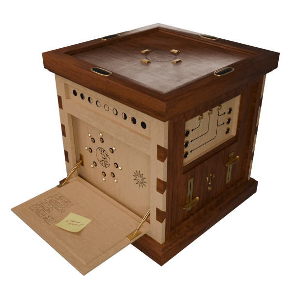

# 🧩 Gideon's Puzzle Box
> An interactive, animated 3D puzzle experience built using Three.js and custom Blender models.  
> A love letter to puzzles, immersive storytelling, and interactive art.

[Click here to view the site](https://puzzlebox.vercel.app/)

## 👤 About the Developer
Hi, I'm Elias Brinkman, a developer with a background in digital art and design, and a love for interactive experiences. 
This project was born out of my fascination with physical puzzle boxes and the desire to reimagine that in a browser-based format.

- 🔗 [Portfolio](https://ezb.xyz)
- 💼 [LinkedIn](https://www.linkedin.com/in/elias-brinkman/)

## ✨ Project Description

The Mysterious Puzzle Box combines intricate puzzle logic, 3D modeling, and interactive game mechanics to create a browser-based art piece. Inspired by escape rooms and mechanical puzzles, it invites users to explore, click, and solve challenges embedded in a mysterious cube.

The journey started with hand-sketched puzzle ideas, which were brought to life through Blender and Three.js. Each mechanism was carefully designed to provide satisfying feedback and to further an overarching metanarrative.

## ✅ Features Implemented

- 🧠 **Original Puzzle Design**  
  - Directional pattern puzzles using secret sequences  
  - Balance-based logic puzzles using real-time array values  
  - Boolean logic pattern recognition

- 🎨 **Custom 3D Assets**  
  - Designed from scratch in Blender  
  - Animated via Three.js based on puzzle progress

- 🖱️ **User Interaction**  
  - Raycasting for user-puzzle interaction  
  - Dynamic feedback through animation and movement

- 📱 **Responsive Design**  
  - Adapts to various screen sizes and devices  
  - Modal overlays scale dynamically

## 🚧 Features in Progress

- 🧩 Convert all puzzles into full 3D interactions  
- 🔊 Add ambient sounds and interaction-based audio  
- 📦 Optimize model performance with Draco compression  
- 🧹 Refactor to class-based architecture and improve state management with local storage

## 🧠 Challenges and Learnings

One of the biggest hurdles was exporting Blender animations that could be controlled dynamically through Three.js. Understanding animation clips, mixers, and syncing with user interaction was no small feat.

Another was balancing performance with quality: large 3D models can kill the framerate, so I've focused a lot on geometry optimization, with continued learning into texture baking and model compression an an ongoing goal.

## 🧰 Built With

- [Blender](https://www.blender.org/)
- [Three.js](https://threejs.org/)
- [Vercel](https://vercel.com/)
